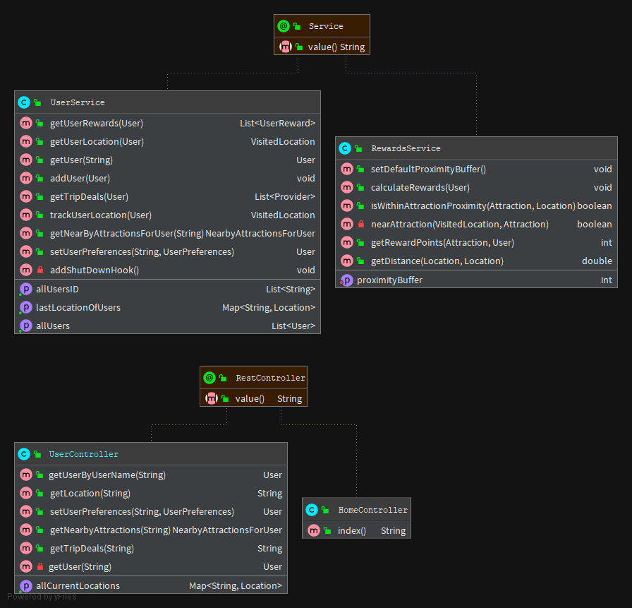

# TourGuide App

TourGuide is a travel and entertainment app made for families : 
- You can get :
    - Users and their location
    - All users locations at a same time
    - Add user's trip preferences
    - Get user's trip deals
    - and... user's nearby attractions in real time!

## Database Schema (UML)




## Prerequisite to run it

- Java 1.8 JDK (or +)
- Gradle 6.6.1 (or +)
- Docker

## Run app (on local port 8080)

Gradle
```
gradle bootRun
```

Spring Boot
```
mvn spring-boot:run (run app)
mvn spring-boot:stop (stop app)
```

## Containerize app (on local port 8081)
At project root:
```
gradle clean
gradle build

docker build -t tourguide .
docker run -p 8081:8080 tourguide
```
How to stop docker container: 
```
docker stop tourguide .
```
How to delete docker's image of TourGuide:
```
docker rmi -f tourguide
```

## Documentation
Read Postman collection to know endpoints features [here](https://github.com/luckavn/sa.projet8/blob/feature/TourGuideLocal.postman.json)
(you should open it with Postman)

## Contributing
Github repo is public, you can fork it and make improvements.
Please make sure to update tests as appropriate.

https://github.com/luckavn/sa.projet8/tree/develop
